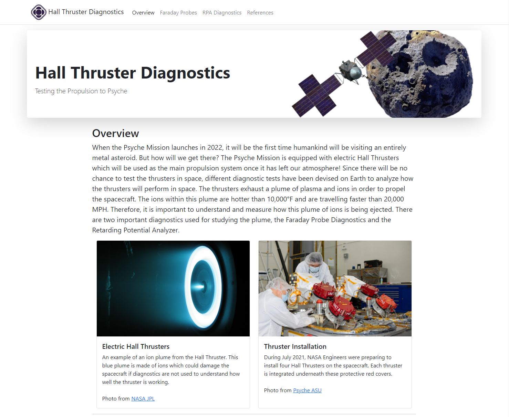
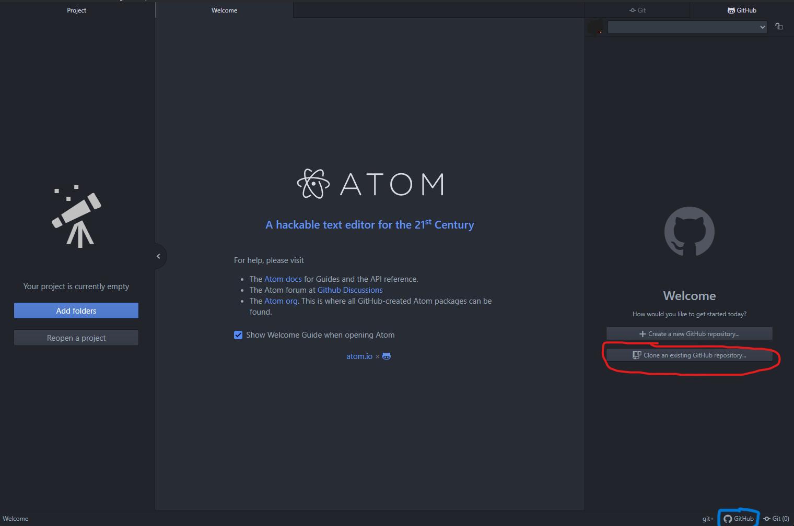
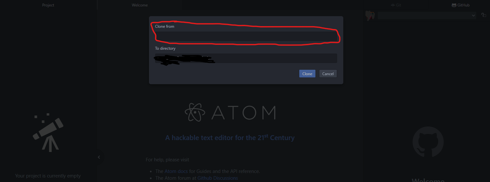
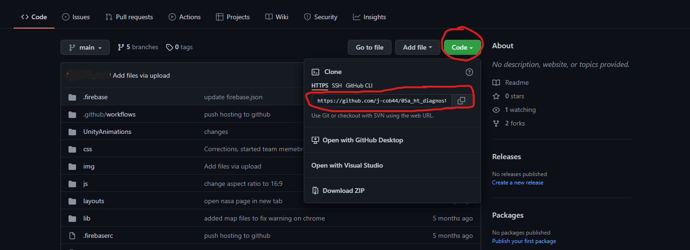
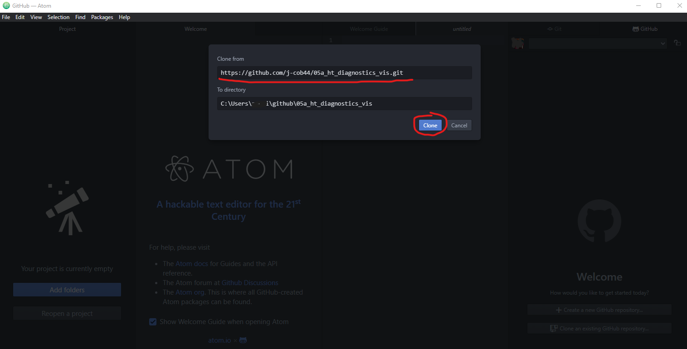
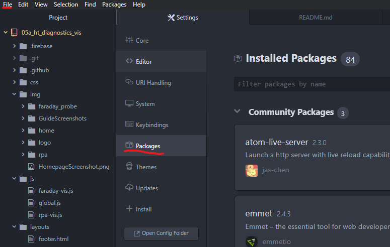
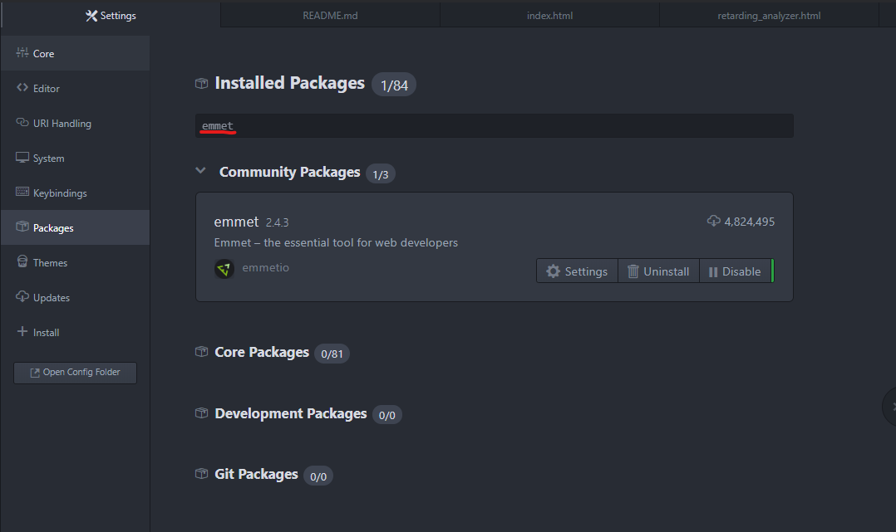
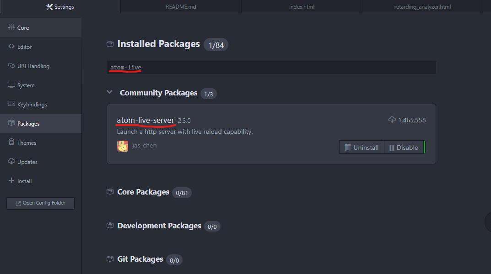
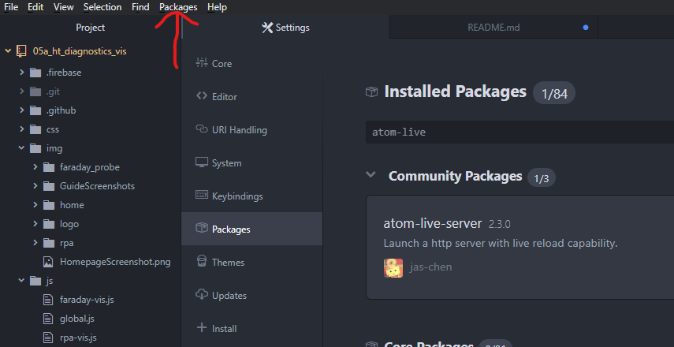
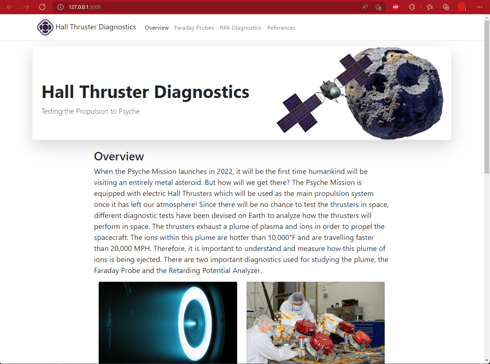

# 2022_05a_HT-Diagnostics-Vis-Website

### Webpage explanation of the Hall Thruster Diagnostics

## Team Members
* Jacob Burton
* Peter Bugala
* Alex Darrah
* Albert Schaffer
* Anderson Sanchez
* Tyler Vaillancourt

#### Arizona State University

## Step by Step Guide
### Step 1:
Have [Atom](https://atom.io/) already installed and clone this repository into Atom.

### Step 2:
Once the repository is cloned, the necessary packages to run the website from Atom need be installed.

To reach the packages option go to ***File->Settings->Packages***

The first package to be installed is "emmet".

The second package to be installed is "atom-live-server". If this package does not appear, it can also be found at [https://atom.io/packages/atom-live-server](https://atom.io/packages/atom-live-server).

### Step 3:
Once those two packages are installed you are ready to view the code.
Open the index.html file and click on the Packages tab, atom-live-server, start server
***Packages->atom-live-server->Start server***

### Step 4:
Once the liver server is started, it should open to your default web browser. The home screen to the webpage will display and from there you are able to use the website normally.

## What Was Used
**Frameworks:** [Bootstrap](https://getbootstrap.com/docs/5.1/getting-started/introduction/), Unity  
**IDE:** [Atom](https://atom.io/), Visual Studio Code  
**Programming Languages:** HTML, CSS  

## Known Issues
1. Ensure Hardware Acceleration is enabled in the Browser for best performance of the Unity WebGL Simulations.
2. Simulations have been disabled for mobile devices due to technical limitations.
